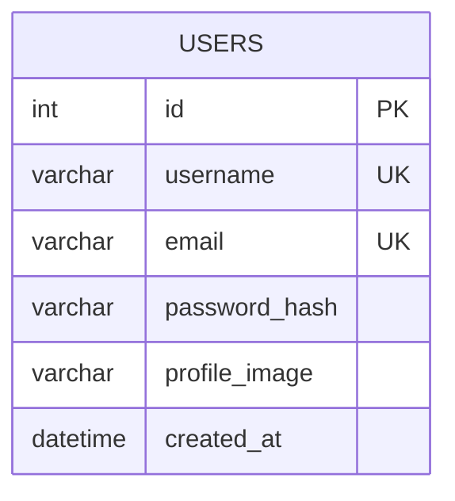

# Database Schema Diagram

## Entity Relationship Diagram

```
┌─────────────────────────────────────┐
│             USERS                   │
├─────────────────────────────────────┤
│ PK  id              INTEGER         │
│ UK  username        VARCHAR(80)     │
│ UK  email           VARCHAR(120)    │
│     password_hash   VARCHAR(255)    │
│     profile_image   VARCHAR(255)    │
│     created_at      DATETIME        │
└─────────────────────────────────────┘
```

## Table Details

### Users Table
**Table Name:** `users`

| Column         | Type          | Constraints           | Description                    |
|----------------|---------------|-----------------------|--------------------------------|
| id             | INTEGER       | PRIMARY KEY           | Unique user identifier         |
| username       | VARCHAR(80)   | UNIQUE, NOT NULL      | User's unique username         |
| email          | VARCHAR(120)  | UNIQUE, NOT NULL      | User's email address           |
| password_hash  | VARCHAR(255)  | NOT NULL              | Hashed password                |
| profile_image  | VARCHAR(255)  | NULL                  | Cloudinary image URL           |
| created_at     | DATETIME      | DEFAULT NOW()         | Account creation timestamp     |

## Indexes
- **Primary Key Index**: `id`
- **Unique Index**: `username`
- **Unique Index**: `email`

## Relationships
Currently, the User table is standalone with no foreign key relationships.

**Future Relationships (when implemented):**
- User → Recipes (One-to-Many)
- User → Payments (One-to-Many)
- User → Groups (Many-to-Many)

## Database Diagram (Mermaid)



## Visual Representation

```
                    ┌──────────────┐
                    │    USERS     │
                    ├──────────────┤
                    │ • id         │
                    │ • username   │
                    │ • email      │
                    │ • password   │
                    │ • image      │
                    │ • created_at │
                    └──────────────┘
```

## Notes
- All passwords are hashed using Werkzeug's security functions
- Email and username must be unique across all users
- Profile images are stored in Cloudinary, only URLs are saved in database
- Timestamps are stored in UTC format
